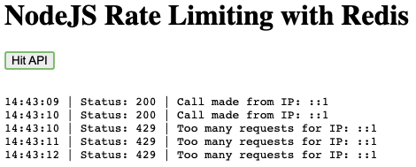

# NodeJS Rate Limit with Redis

## Setup

1. Install Redis. `brew install redis`
2. Initialize node. `node init -y`
3. Install packages. `npm install`
4. Create and fill out `.env` file. `cp .env-template .env`

## Execution with local Redis

1. Run Redis server. `redis-server`
2. Run. `node index.js`
3. Navigate to `http://localhost:3000/`

## Execution with cloud Redis

1. Create Redis database at [redis.com](https://redis.com/)
2. Provide credentials in `.env`
3. Run. `node index.js`

## Useful links

https://github.com/animir/node-rate-limiter-flexible/wiki/Overall-example
